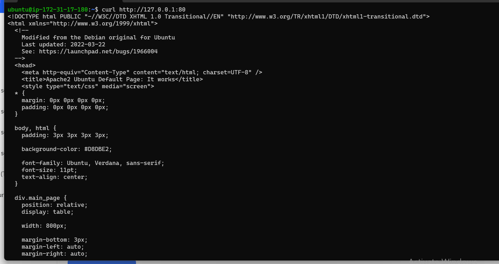
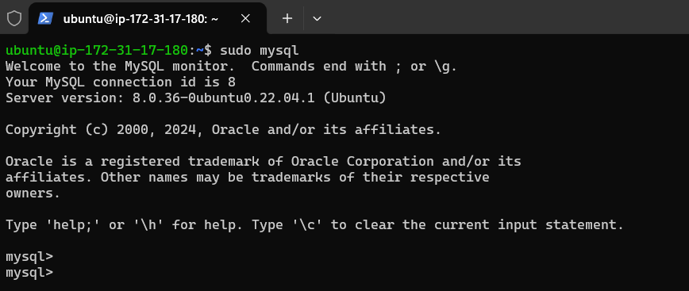
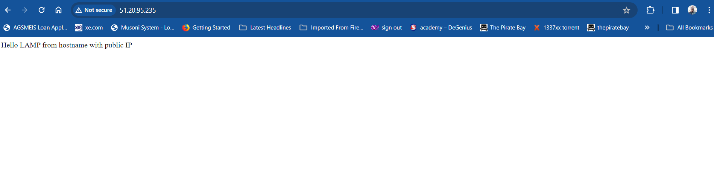

# Preparing Prerequisites

    1. I created my AWS account
    2. I successfully launched an EC2 instance (ubuntu 22.04)
    3. I was able to connect (ssh) to my EC2 instance from Powershell on my local PC using the PEM file (PBL.pem) I downloaded to my PC from my AWS account. The ssh command is 'ssh -i "PBL.pem" ubuntu@ec2-13-48-1-84.eu-north-1.compute.amazonaws.com'
    4. I tried out some linus commands as well: 'ls -l', 'mkdir', 'touch', used 'vi' to edit a new file and 'cat' to view its content.

# Installing Apache and Updating the Firewall

#### Step 1 - Install Apache2 and Update the Firewall
    run 'sudo apt update'

    run 'sudo apt install Apache2

    Confirm that Apache2 is running: 'sudo systemctl status apache2'

Add an Inbound rule to EC2 configuration to open inbound connection through port 80

run 'curl http://localhost:80' or 'curl http://127.0.0.1:80' to request Apache HTTP Server on port 80.

Input "http://(public ip):80" on a web browser to access the Apache web server. The image below shows that the web server is running and is accessible through my firewall.

# Installing MySql
#### Step 2 - Install Mysql
Mysql ia a relational database used with PHP. It allows for storage and management of data on our site.

run 'sudo apt install Mysql-server'

run 'sudo Mysql' to login to Mysql server as admin user **root**.

Secure access to Mysql server by intorducing a password.

run 'ALTER USER 'root'@'localhost' IDENTIFIED WITH mysql_native_password BY 'PassWord.1';' to define the user password as "PassWord.1"

Exit mysql server by typing 'exit' and press enter.

run 'sudo mysql_secure_installation' to start the interactive script to enable a password or not.

run 'sudo mysql -p' : the flag -p, to allows for root user password prompt. I entered the password "PassWord.1" to access mysql since i didn't activate the VALIDATE PASSWORD PLUGIN.

# Installing PHP
#### Step 3 - Install PHP
I will also istall php-mysql (a module that allows PHP communicate with mysql based database) and libapache2-mod-php ( amodule to enable Apache handle PHP files). All 3 packkages can be installed at once.
run 'sudo apt install php libapache2-mod-php php-mysql' to install the 3 packages.

run 'php -v' to confirm the PHP installation and version.

# Enabling PHP on The Website
#### Step 4 - Creating a Virtual Host for your Website using Apache

Setup a domain called "projectlamp" by creating a directory using command 'mkdir'.
run 'sudo mkdir /var/www/projectlamp'
Also assign ownership to the directory by running 'sudo vi /etc/apache2/sites-available/projectlamp.conf'

Use 'vi' or 'vim' to create and edit the file "projectlamp.conf" in Apache's "sites available" directory.

Run 'sudo vim /etc/apache2/sites-available/projectlamp.conf' and add the follwoing Virtual Host Configuration:

    <VirtualHost *:80>
        ServerName projectlamp
        ServerAlias www.projectlamp 
        ServerAdmin webmaster@localhost
        DocumentRoot /var/www/projectlamp
        ErrorLog ${APACHE_LOG_DIR}/error.log
        CustomLog ${APACHE_LOG_DIR}/access.log combined
    </VirtualHost>

Run 'sudo ls /etc/apache2/sites-available' to list files and as seen projectlamp.conf is available.

Run 'sudo a2ensite projectlamp' to enable the virtual host. "a2ensite" is a script that enables the specified site (in this case, www.projectlamp) contained in the virtual host config file.

To avoid any conflicts, disable the default site that comes with apache2 installation (000-default). Run the command 'sudo a2dissite 000-default'

Notice that I have realoded Apache2 server using the command **'sudo systemctl reload apache2'** to allow the changes take effect.

Run 'sudo apache2ctl configtest'to ensure your config file doesn't contain syntax errors.

create a website file index.html in projectlamp directory

'sudo echo 'Hello LAMP from hostname' $ (curl -s http://169.254.169.254/latest/meta-data/public-hostname) 'with public IP' $(curl -s http://169.254.169.254/latest/meta-data/public-ipv4) > /var/www/projectlamp/index.html'

Test that the website is working by entering the url in the browser: http://(my-public-ip):80

You can use the public DNS as well with or without the port will give same output; http://ec2-51-20-95-235.eu-north-1.compute.amazonaws.com

# Creating a Virtual Host for Your Website using Apache
#### Step 5 - Enable PHP on the website

Change the order in which the index.php file is arranged to allow it being the first to be accessed.

Run 'sudo systemctl reload apache2' to reload Apache2 for changes to take effect

Create a PHP file to test that PHP is correctly installed and configured on the server

run 'vim /var/www/projectlamp/index.php' to create and edit index.php

After editing and saving the file index.php, refresh the URL and it should display the webpage below:

After viewing the page, we may need to delete the index.php file as it contains sensitive information about your server and PHP environment.

run 'sudo rm /var/www/projectlamp/index.php' to remove the file.

If you refresh the webpage again, it returns to the index.html which is the only file in projectlamp directory and the next file in line in the dir.conf script.

