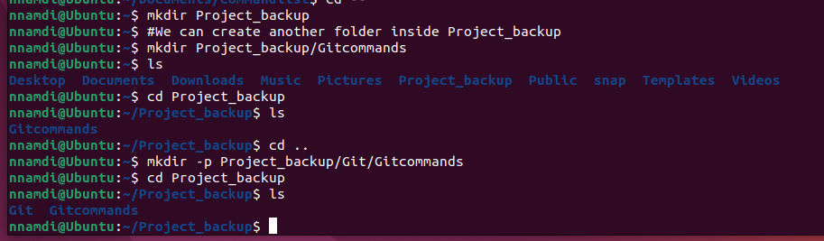

# Linux Practice Projects

## 1. 'sudo' superuser do command
Allows you perform tasks that require administrative or root permission.
It requires user authentication

## 2. 'pwd' present/current working directory command
This command displays your present working directory. It shows the path to the current working directory using slash (l)

## 3. 'cd' chnage directory command
This command allows users navigate their directories/folders. 

"cd (foldername or path)" e.g cd CommandsLinux or cd /home/nnamdi/CommandsLinux

### Options for cd include cd - and cd --
"cd -" takes you back to the previous directory and 

"cd --" takes you back to the user directory as seen below.

# 4. 'ls' command
list files and directories within a system and it has the ffg. options

ls -R

ls -a

ls -lh

# 5. 'cat' command
This command reads, combines and writes file content on the CLI

It can also be used to merge/concatenate files and their contents. see image below

# 6. 'cp' command
Copy files to and fro directories, ***cp filename directory path***

copy contents of one file to a new file, ***cp source filename destination filename*** (ensure to add the filename extensions e.g .txt) In the shot below, I copied the content of firstfile.txt to a new file i created named fourthfile.txt

copy entire directories, ***cp -R source dir destination dir***
Here I copied the directory commandlist in Linuxcommand directory to Documents.

# 7. mv command:

This is used to **move and rename** files and directories.

In the image below, I have simply used ***mv current filename new filename*** to rename a file sqlite_commands.sh to sql_commands.sh

# 8. mkdir command:

This command is used to create new directories. In the image below I used 'mkdir' to create the folder Project_backup and Gitcommands.

The command options "-p" and "-m" are used to create folders in-between existing folders or create folders with permissions.

