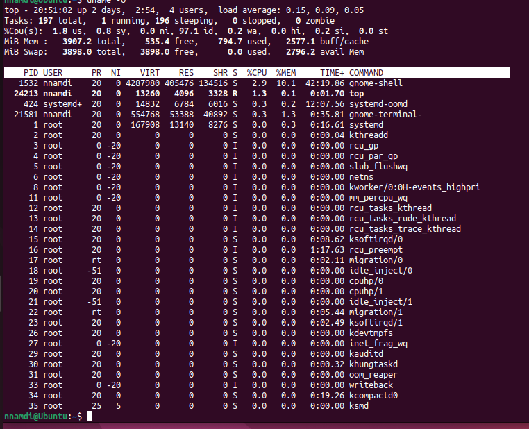
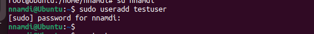
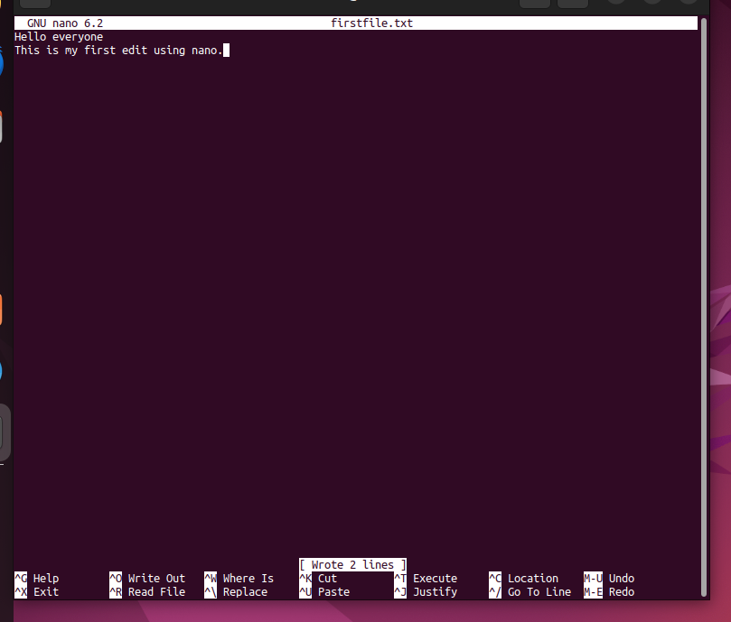
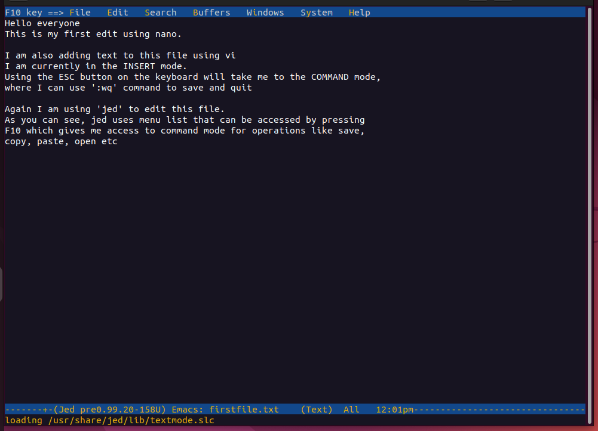

# 21. 'chmod' command (change mode)

This command modifies the read, write and execute(rwx) permissions of a file or directory. 3 sets of users can have their permissions modified; Owner, Group members and Others.

In the immage below, I gave permission to all users to be able to read, write and execute the file sqlite_commands.sh (the permission was initially -rw-rw-rw-- and changed to -rwxrwxrwx-).

# 22. 'chown' command (change ownership)

This command allows me change the ownership of a file or directory from one user to another. I used this command to switch ownership of the *sqlite_commands.sh* file from the initial owner *nnamdi* to a new user *uzoma*. This change can only be made as a root or superuser.

# 23. 'jobs' command

This command displays a list of running processes and their status. It returns nothing if there are no processes running. Options available are:

jobs -l, list process IDs in addition to the normal information

jobs -n, list only processes that have changed status since the last notification

jobs -p, lists process IDs only

# 24. 'kill' command

This command is used to manually terminate processes, especially unresponsives ones. You must know the process ID (PID) and the signal to use. Where the signal isn't specified, the default *TERM* signal is sent to terminate the process.

In the image above, I started the firefox browser on the desktop, got its PID (21882) with *pgrep* command. I then ran *kill -9 21882* to kill the process where -9 is the code for kill signal SIGKILL. SIGKILL kills a process forcefully while SIGTERM ( -15) terminates the process while saving its progress.

# 25. 'ping' command

Very commonly used to check that a network or server is reachable. It is also used to troubleshoot connectivity issues.

# 26. 'wget' command

Files are downloaded from the internet using this command. It is non-interactive running in the background without interrupting other processes.

# 27. 'uname' command

This command provides key details about your Linux OS. It is like asking your OS, "who are you and what are you made of?"

# 28. 'top' command

*top* displays information about all processes running on your PC showing a dynamic realtime view of your PC. Its diplay is similar to the running processes display task manager in Windows.

# 29. 'history' command

Depending on the Linux shell in use, this command list over 500 previously executed commands. This allows for reuse of commands. You must have sudo priviledges for this to work.

The second image above shows that we can also list a number of commands counting buttom-up.

# 30. 'man' command

This displays user manual for commands in Linux. 

This is only 17% (39 lines) of the information in the user manual for '**ls**' command. The full manual contains 226 lines of information.

# 31. 'echo' command

This is a command that allows users to display lines of text or strings that are passed as arguments.

# 32. 'zip', 'unzip' commands

The zip command is used to compress files into a ZIP file usually to reduce disk usage. It is also used for archiving files and directories. Using zip, I compressed *capital.txt and state.txt to archive2.zip* I also unzipped the file to extract them again.

# 33. 'hostname' command

I used this command to reveal my system's hostname.

# 34. 'useradd', 'userdel commands

useradd is for adding new Users or Accounts to the system while userdel deletes users or accounts. Only users with root priviledges can run these commands.

# 35. 'apt get' command

This command retrieves information and packages from authenticated sources for installation, upgrade, and removal of packages along with their dependencies. Only users with sudo or root priviledges can use this command. I tried '*sudo apt-get update*' , see results below; this process updated package list of my Linux OS for available software packages.

# 36. 'nano', 'vi', and 'jed' commands

The above commands are all used for editing or modifying files.

nano comes with Linux OS, works with most most languages, it denotes keywords.

vi also comes with Linux OS, has 2 working modes (insert and command modes). Insert mode is for editing while command mode is for operations such as save, quit, copy, paste, open.

while jed has a drop down menu that allows users perform actions without entering commands. It also works with modes. I will use 'sudo apt install jed' to install 'jed' before I can use it.

I used jed to add text to the file firstfile.txt demostrated in the image below.

# 37. 'alias', 'unalias' commands

An alias is a user-defined shorthand for a longer command or sequence of commands. *alias* command instructs the shell to replace one string with another string while executing the commands. I have aliased the command *'cd Documents'* to become *'CD'*    *'alias -p'* option prints a list of aliases in the system.

'unalias' command will undo the alias.

# 38. 'su' (switch user) command

This command allows you run programs as a different user. It is important to note that when this command is executed, the user priviledges changes but it retains the current users environment. The benefit is to allow access to the system through SSH or use of GUI display manager when the root is unavailable.

# 39. 'htop' command

This command is used to monitor system processes and server resources in realtime. You can perform mouse operations and see visual indicators.

# 40. 'ps' (process status) command

The ps command gives a snapshot of the running processes on your system. It shows the PID, Terminal type, TIME and CMD. Other options may have extended fields of information as shown in the image below.

